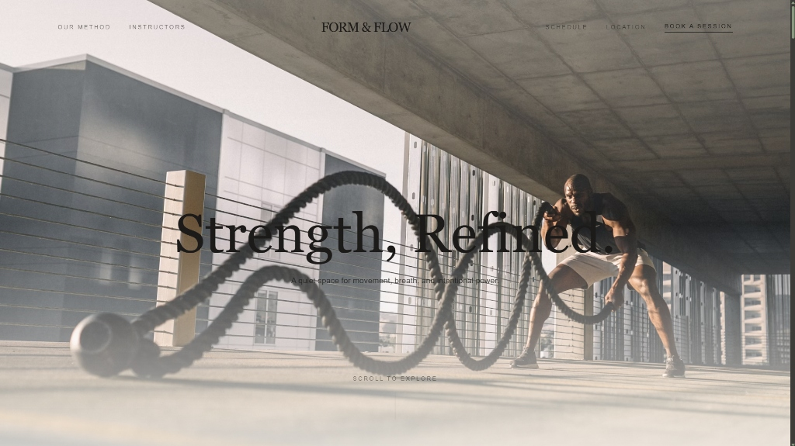
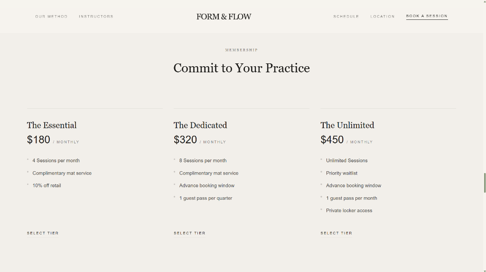
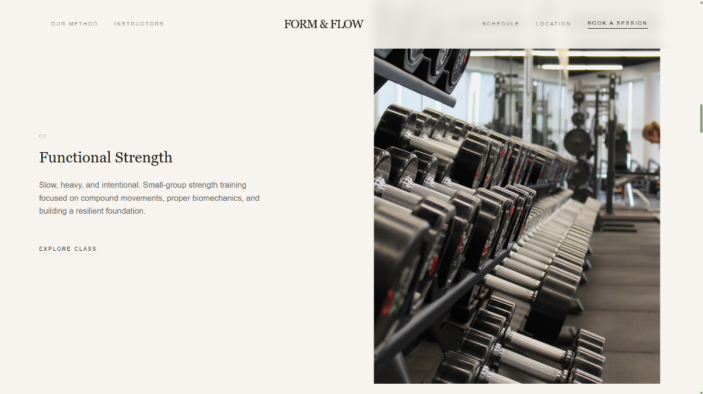
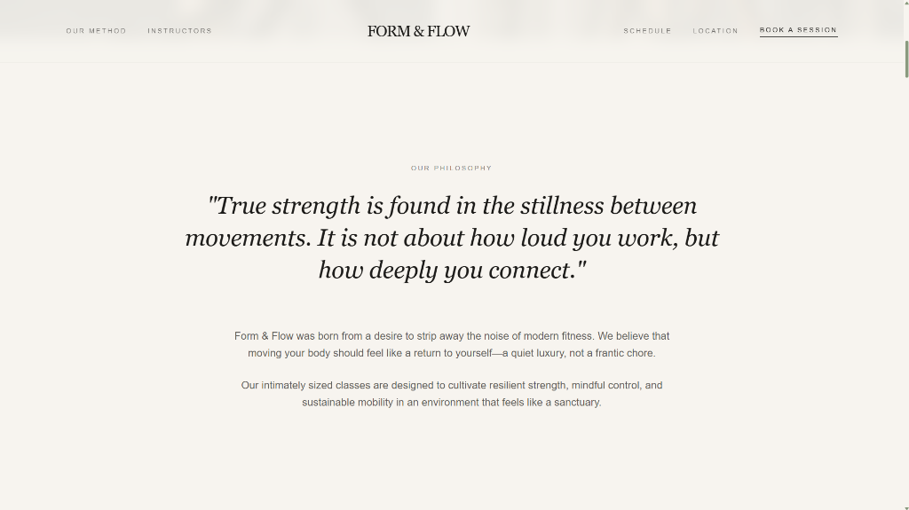
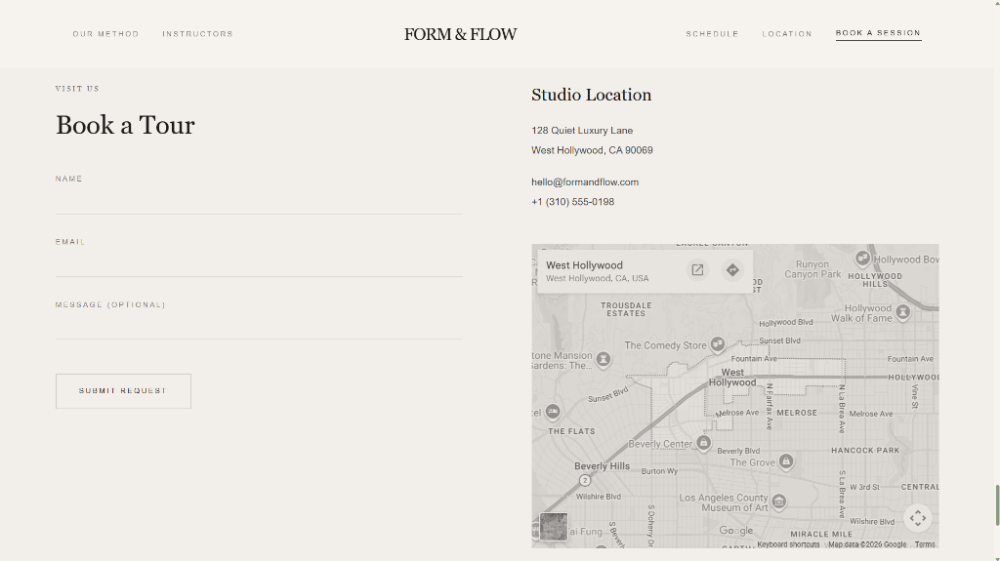

# Form & Flow | Premium Fitness Studio

A premium, minimalist landing page for **Form & Flow** fitness and wellness studio. Built with a sophisticated cream-and-sage color palette, custom dynamic scrollbar styling, responsive layout, and smooth animations using Motion.

---

## Preview Screenshots

### 1. Hero Section


### 2. Philosophy Section


### 3. Method Section


### 4. Memberships Section


### 5. Location & Contact Section


---

## Get Started

### Prerequisites
- [Node.js](https://nodejs.org/) (v18 or higher recommended)

### Installation
1. Clone the repository and navigate into the folder:
   ```bash
   cd fitness-form-flow-studio
   ```

2. Install dependencies:
   ```bash
   npm install
   ```

3. Run the development server:
   ```bash
   npm run dev
   ```
   Open your browser to [http://localhost:5173](http://localhost:5173) to see the application.

4. Build for production:
   ```bash
   npm run build
   ```

---

## Technology Stack

- **Core**: React, TypeScript, Vite
- **Styling**: Tailwind CSS
- **Animations**: Motion (Framer Motion)
- **Icons**: Lucide React

## Key Features

- **Premium Visual Aesthetics**: Uses HSL-tailored colors (Cream `#F7F4EF`, Charcoal `#1C1B19`, Sage `#8A9A7E`) with premium typography.
- **Dynamic Scrollbar**: Custom scrollbar that dynamically changes the track background on scroll—dark charcoal on the Hero section to match the dark image, transitioning to cream for content sections.
- **Fluid Layout**: Fully responsive layout designed for mobile, tablet, and desktop viewports.
- **Polished Animations**: Smooth scroll-triggered fade-ups and micro-interactions on inputs/buttons.
